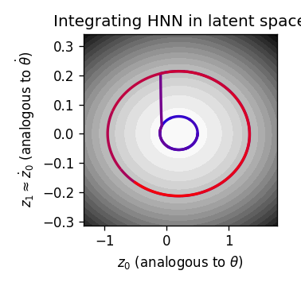

Hamiltonian Neural Networks
=======
Sam Greydanus, Misko Dzamba, Jason Yosinski | 2019

Contribution and workflow
--------
_We'll remove this section when we open-source_
 * Each experiment gets its own folder, labeled `experiment-{name}/`. All experiment-specific data, training code, saved logging info, etc goes in that folder.
 * Any code that is shared across more than one experiment goes in the top level directory. Examples include `utils.py`, `nn_model.py` and the HNN base file, `hnn.py`
 * I'm doing all analysis and plotting in Jupyter notebooks. I'm open to other suggestions. In general, all analysis notebooks go in the top-level directory and get named `analysis-{name}.ipnyb`.
 * The `figures` directory is where you write any figures, movies, gifs, etc.
 * The `static` directory is where you _manually_ move figures, GIFs, etc. once you are happy with them. This prevents you from accidentally overwriting them.
 * Put high-res (300dpi) PDFs in `static/pdfs`. Most conferences require these settings for paper figures.

Basic usage
--------

To train a Hamiltonian Neural Network (HNN):
 * Toy task (circular vector field + noise): `python3 experiment_toy/train.py --verbose`
 * Lipson data (simulated/real pendulum data): `python3 experiment_lipson/train.py --verbose`
 * Pixel observations (from OpenAI Gym): `python3 experiment_pixels/train.py --verbose`

To analyze results
 * Toy task: `analyze-toy.ipnyb`
 * Lipson data: `analyze-toy.ipnyb`
 * Pixel observations: `analyze-pixels.ipnyb`

Summary
--------

 * [Planning doc](https://docs.google.com/document/d/1WLprq600etYrqc51GLm5uTd2sTBeMYB5MUakJigCSEw/edit)
 * [Shared folder](https://drive.google.com/open?id=1869p7KJfOV5rI5HflTb7DmdnuSNbMyFU)

Modeling the conserved quantities of a physical system is one gateway to understanding its dynamics. Physicists use a mathematical object called the Hamiltonian to do this. They often use domain knowledge and trickery to write down the proper Hamiltonian, but here we take a different approach: we parameterize it with a differentiable model and then attempt to learn it directly from real-world data.

### Test loss
|               | Baseline NN 			| Hamiltonian NN 	|
| ------------- | :-------------------: | :---------------: |
| Toy 			|  	1.1674    	  		| **0.7676** 		|
| Pend-Sim 		|   **0.0018**  		| 0.0135 			|
| Pend-Real		|   **0.0014**   		| 0.0058 		 	|

### Energy MSE
|               | Baseline NN 			| Hamiltonian 		|
| ------------- | :-------------------:	| :---------------:	|
| Toy 			| 4.3797				| **0.0047** 		|
| Pend-Sim 		| 0.8670				| **0.1200** 		|
| Pend-Real		| 0.0783				| **0.0023**		|

The HNN recipe
--------

1. Make a dataset of pixel-space observations of a physical system where energy is conserved. Here we're working with a pendulum.

2. Train an autoencoder on the dataset. The autoencoder is a bit unusual: its latent representation gets fed to the HNN, which tries to model the system's dynamics in latent space.

3. Since the HNN uses the latent representation to model dynamics, we can think of the latent factors as being analogous to canonical coordinates (e.g. position and velocity).

4. [Phase space plots](https://en.wikiversity.org/wiki/Advanced_Classical_Mechanics/Phase_Space) are a common way to visualize Hamiltonians. We can make a phase space plot in the autoencoder's latent space. We can also integrate along the energy contours of phase space to predict the dynamics of the system (in the figure below, we intentionally "add energy" halfway through).

5. After integrating in latent space, we can project back into pixel space to simulate the dynamics of the system.

Here's what it looks like when we add energy halfway through the simulation:

Dependencies
--------
 * OpenAI Gym
 * PyTorch
 * NumPy
 * ImageIO
 * Scipy

Known issues
--------
 * None so far \m/