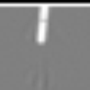

Hamiltonian Neural Nets
=======
Sam Greydanus, Misko Dzamba, Jason Yosinski | 2019

Usage
--------

Experiments
 * To train a Hamiltonian Neural Network (HNN):
 	* Lipson data (simulated pendulum) `python3 hnn_lipson_task.py --name sim`
 	* Lipson data (real pendulum) `python3 hnn_pixel_task.py --name real`
 	* OpenAI Gym observations (pixel data) `python3 hnn_pixel_task.py`

Analysis
 * Coming soon...

Summary
--------

* [Planning doc](https://docs.google.com/document/d/1WLprq600etYrqc51GLm5uTd2sTBeMYB5MUakJigCSEw/edit)
* [Shared folder](https://drive.google.com/open?id=1869p7KJfOV5rI5HflTb7DmdnuSNbMyFU)

Modeling the conserved quantities of a physical system is one gateway to understanding its dynamics. Physicists use a mathematical object called the Hamiltonian to do this. They often use domain knowledge and trickery to write down the proper Hamiltonian, but here we take a different approach: we parameterize it with a differentiable model and then attempt to learn it directly from real-world data.

The HNN recipe
--------

1. Make a dataset of pixel-space observations of a physical system where energy is conserved. Here we're working with a pendulum.

2. Train an autoencoder on the dataset. This autoencoder is a but unusual - its latent representation gets fed to the HNN, which tries to model the system's dynamics in latent space.

3. Since the HNN uses the latent representation to model dynamics, we can think of the latent factors as being analogous to canonical coordinates (e.g. position and velocity).

4. [Phase space plots](https://en.wikiversity.org/wiki/Advanced_Classical_Mechanics/Phase_Space) are a common way to visualize Hamiltonians. We can make a phase space plot in the autoencoder's latent space. We can also integrate along the energy contours of phase space to predict the dynamics of a system (in the figure below, we intentionally "add energy" halfway through).

5. After integrating in latent space, we can project back into pixel space to simulate the dynamics of the system.

6. Profit :)